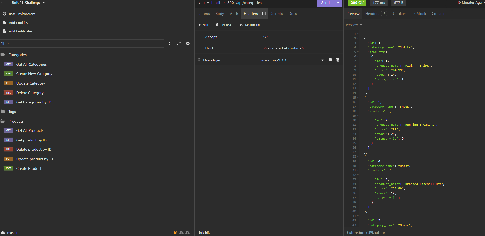

# E-Commerce-Back-End-Server

## Intro
The E-Commerce Back-end Sever is an ExpressJs server with a database supported with Sequelize, pg, and dotenv modules. It uses routes to send, create, update, and delete data based on param inputs.

## Installation 
- Clone this repository
- Open the directory in the terminal
- run the following commands:
- `npm init -y`
- `npm i`
- `psql -U postgres`
- `\i db/schema.sql`
- `\q` to quit postgres
- `npm run seed`
- `npm start`

The last step will launch the server.
Testing for successful server interactions can be done in Insomnia

## Live URLs
[Tutorial Video](https://drive.google.com/file/d/1hUQNvPLcv9w7qEZjNNLPTWLzvl16zYHG/view?usp=sharing) \
[Github Repo](https://github.com/aharper2568/E-Commerce-Back-End-Server)

## Screenshots

## Author

Developed in VSCode by  **Anthony Harper**